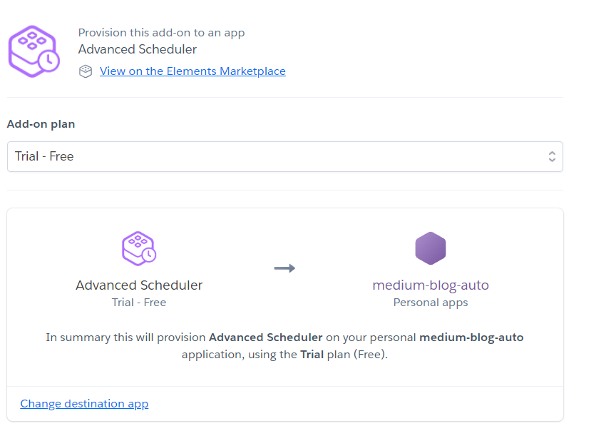

# Medium Blog Recommendation Automation
Reading blogs and articles has become a daily habit for me. Medium is an online publishing platform website that I use on a daily basis, and I decided to combine it with the Telegram app that I use every day for the convenience of my work, using a Telegram bot and data from the site's recommendation. Medium recommends me to collect articles related to my favorite topics and use them daily for myself through the Telegram bot.

 

# Project Overview :

# 1 - Get recommended blogs 
I found that Medium fetches the suggested blogs from a Graph QL Api, which I used for this project.
<p></p>

# 2 - Set up telegram bot 
In order to create a Telegram bot, I used botfather, which is a bot that creates a Telegram bot. With the /newbot command and choosing the name and ID for the Telegram bot, it will give you an api key that you can use to command your bot.
<p></p> 
<p></p>
<p></p>


# 3 - Setup Automation process
To send the blogs, I first created a group in Telegram and added the created bot to it, and using the Python [telebot](https://pypi.org/project/telebot7/) and [request]([requests](https://pypi.org/project/requests/) libraryو I sent selected blogs to the group.


# 4 - Scheduled Automation Script
<p></p> 
I had scheduled the suggested blogs to be sent to me at a certain time every day. And for this, I used Heroku's advanced-scheduler, which allows me to use a specific time to run my automation script.

#### Install Libraries

```pip install -r requirements.txt```

##  Libraries used in the project

- [pyTelegramBotAPI](https://pypi.org/project/pyTelegramBotAPI/)
- [telebot](https://pypi.org/project/telebot7/)
- [requests](https://pypi.org/project/requests/)
