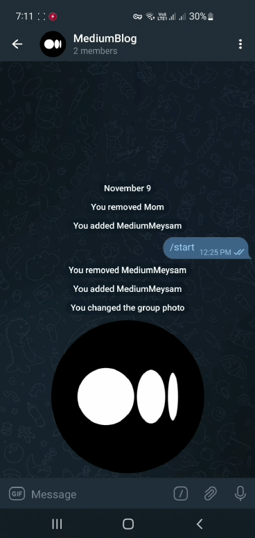
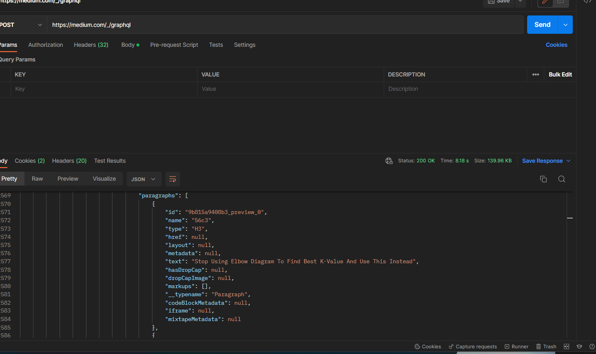
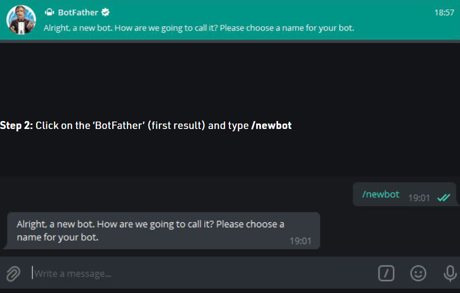
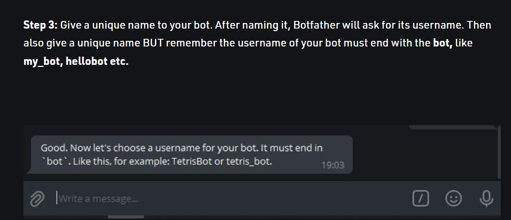
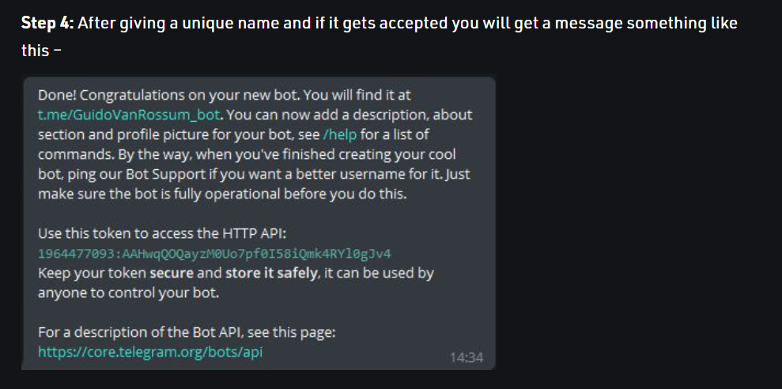

# Medium Blog Recommendation Automation
Reading blogs and articles has become a daily habit for me. Medium is an online publishing platform website that I use on a daily basis, and I decided to combine it with the Telegram app that I use every day for the convenience of my work, using a Telegram bot and data from the site's recommendation. Medium recommends me to collect articles related to my favorite topics and use them daily for myself through the Telegram bot.

 

# Project Overview :

# Get recommended blogs 
I found that Medium fetches the suggested blogs from a Graph QL Api, which I used for this project.

# Set up telegram bot 
In order to create a Telegram bot, I used botfather, which is a bot that creates a Telegram bot. With the /newbot command and choosing the name and ID for the Telegram bot, it will give you an api key that you can use to command your bot.

 

